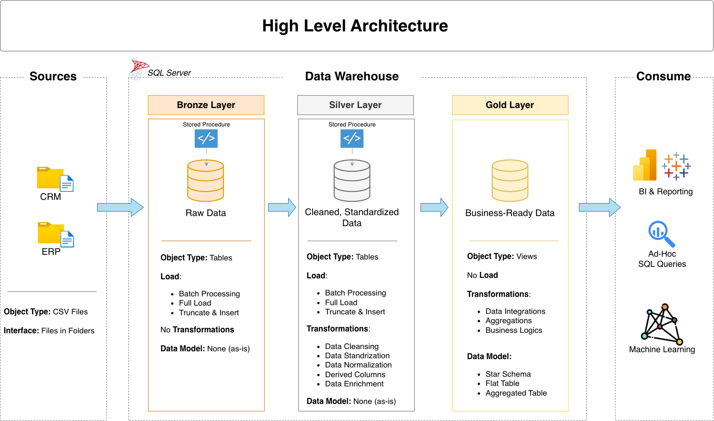
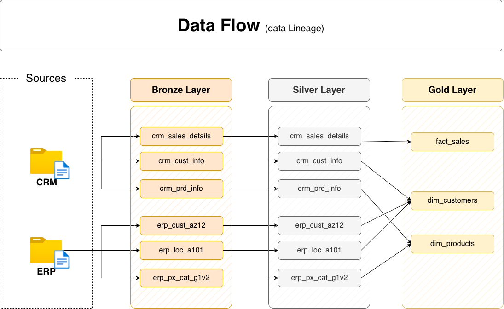
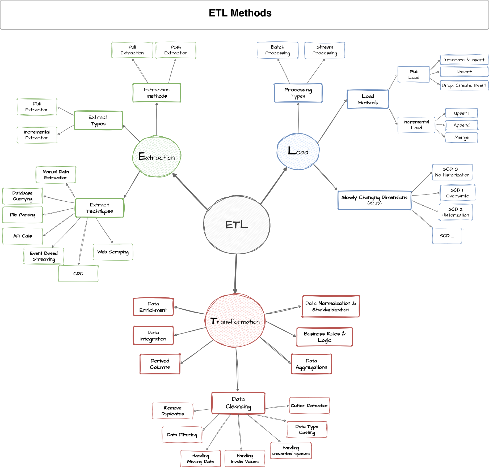
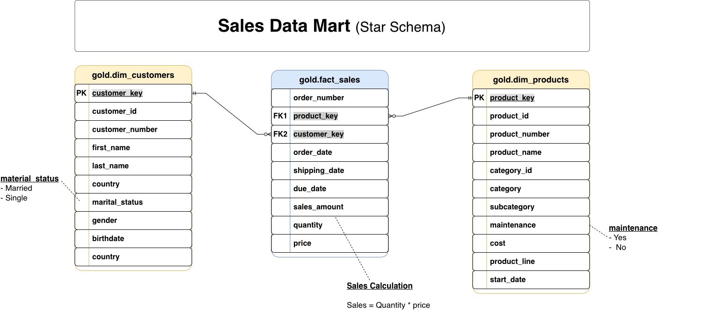

# SQL Data Warehouse Project

An end-to-end **SQL Server Data Warehouse and Analytics project** that integrates CRM and ERP data into a centralized analytical data warehouse using **Medallion Architecture**, **ETL pipelines**, and a **Star Schema**.

The project demonstrates practical data engineering workflows including data ingestion, data cleansing, source integration, dimensional modeling, data quality validation, and preparation of data for analytics and reporting.

---

## 📌 Project Overview

The objective of this project is to build a modern data warehouse that consolidates sales-related data from multiple source systems into a structured and analytics-ready model.

The project focuses on:

* Integrating **CRM and ERP** source data
* Building a **Bronze, Silver, and Gold** data architecture
* Developing reusable SQL-based ETL pipelines
* Cleaning and standardizing raw data
* Resolving data quality issues
* Integrating data from different source systems
* Creating a **Star Schema** for analytical queries
* Validating data using SQL-based quality checks
* Preparing the warehouse for customer, product, and sales analysis

The project uses the **latest available dataset only**; historical data tracking and Slowly Changing Dimensions are outside the current scope.

---

# 🏗️ Data Architecture

The warehouse follows a **Medallion Architecture** consisting of three layers:

**Source Systems → Bronze → Silver → Gold → Analytics & Reporting**



### Bronze Layer

The Bronze layer stores data in its raw form with minimal transformation.

**Purpose:**

* Ingest raw CRM and ERP data
* Preserve source-level information
* Maintain a reliable landing layer
* Load CSV files into SQL Server tables

**Sources:**

* CRM
* ERP

---

### Silver Layer

The Silver layer contains cleaned and standardized data.

**Key operations include:**

* Removing unwanted spaces
* Handling duplicate records
* Standardizing categorical values
* Handling invalid or missing dates
* Validating numeric values
* Resolving inconsistencies between source systems
* Standardizing customer and product information
* Preparing data for integration

The Silver layer acts as the main transformation and data-quality layer.

---

### Gold Layer

The Gold layer contains business-ready data designed for analytics and reporting.

It follows a **Star Schema** consisting of:

* `gold.dim_customers`
* `gold.dim_products`
* `gold.fact_sales`

This layer provides a simplified structure for analytical queries and reporting.

---

# 🔄 Data Flow



The overall data flow is:

```text
                 SOURCE SYSTEMS
                      │
          ┌───────────┴───────────┐
          │                       │
         CRM                     ERP
          │                       │
          └───────────┬───────────┘
                      ▼
                BRONZE LAYER
              Raw Source Data
                      │
                      ▼
                SILVER LAYER
          Cleaned & Standardized Data
                      │
                      ▼
                  GOLD LAYER
             Business-Ready Model
                      │
          ┌───────────┼───────────┐
          ▼           ▼           ▼
     fact_sales  dim_customers  dim_products
```

---

# 🔧 ETL Pipeline



The ETL process consists of three main stages.

### 1. Extract & Load

Raw CSV files from CRM and ERP systems are loaded into the Bronze layer.

```text
datasets/
├── source_crm/
└── source_erp/
```

The Bronze loading process is implemented using SQL Server stored procedures and `BULK INSERT`.

---

### 2. Transform

The Silver layer applies data cleansing and transformation rules.

Examples include:

* Data type conversion
* Date validation
* Duplicate detection
* String standardization
* Business rule validation
* Handling invalid sales values
* Customer and product integration

---

### 3. Model

The Gold layer transforms the cleaned data into analytical dimensions and fact tables.

```text
                    ┌───────────────────┐
                    │  dim_customers    │
                    └─────────┬─────────┘
                              │
                              │
                              ▼
                       ┌──────────────┐
                       │  fact_sales  │
                       └──────┬───────┘
                              │
                              │
                              ▼
                    ┌───────────────────┐
                    │   dim_products    │
                    └───────────────────┘
```

---

# 📊 Data Model



The Gold layer uses a **Star Schema** optimized for analytical queries.

### `gold.dim_customers`

Contains customer information enriched with demographic and geographic attributes.

Key attributes include:

* `customer_key`
* `customer_id`
* `customer_number`
* `first_name`
* `last_name`
* `country`
* `marital_status`
* `gender`
* `birthdate`
* `create_date`

---

### `gold.dim_products`

Contains product information and product classification.

Key attributes include:

* `product_key`
* `product_id`
* `product_number`
* `product_name`
* `category_id`
* `category`
* `subcategory`
* `maintenance_required`
* `cost`
* `product_line`
* `start_date`

---

### `gold.fact_sales`

Contains sales transaction data used for analytical calculations.

Key attributes include:

* `order_number`
* `product_key`
* `customer_key`
* `order_date`
* `shipping_date`
* `due_date`
* `sales_amount`
* `quantity`
* `price`

The fact table connects customer and product dimensions through surrogate keys.

---

# 🔗 Source Systems

The project integrates two source systems.

### CRM

Contains:

* Customer information
* Product information
* Sales transactions

### ERP

Contains:

* Customer demographic information
* Customer location information
* Product category information

The two systems are integrated in the Silver layer to produce unified business entities in the Gold layer.

---

# 🎯 Business & Analytics Scope

The warehouse is designed to support analysis of:

### Customer Behavior

Examples:

* Customer demographics
* Customer distribution by country
* Customer purchasing activity

### Product Performance

Examples:

* Product sales
* Product categories
* Product and subcategory performance
* Product cost analysis

### Sales Trends

Examples:

* Sales over time
* Order volumes
* Revenue analysis
* Customer and product sales performance

The Gold layer provides the foundation for SQL-based reports, dashboards, and BI tools.

---

# ✅ Data Quality

Data quality checks are implemented to ensure that the analytical layer contains reliable data.

## Silver Layer Checks

The Silver validation process checks for:

* Null values
* Duplicate records
* Invalid dates
* Incorrect data types
* Unwanted spaces
* Invalid sales values
* Invalid quantities
* Invalid prices
* Inconsistent categorical values

Run:

```text
tests/quality_checks_silver.sql
```

---

## Gold Layer Checks

The Gold validation process checks for:

* Duplicate surrogate keys
* Missing dimension records
* Invalid fact-to-dimension relationships
* Referential integrity issues

Run:

```text
tests/quality_checks_gold.sql
```

---

# 📁 Repository Structure

```text
sql-data-warehouse-project/
│
├── datasets/
│   ├── source_crm/
│   │   ├── cust_info.csv
│   │   ├── prd_info.csv
│   │   └── sales_details.csv
│   │
│   └── source_erp/
│       ├── CUST_AZ12.csv
│       ├── LOC_A101.csv
│       └── PX_CAT_G1V2.csv
│
├── docs/
│   ├── ETL.png
│   ├── data_architecture.png
│   ├── data_catalog.md
│   ├── data_flow.png
│   ├── data_integration.png
│   ├── data_layers.pdf
│   ├── data_model.png
│   └── naming_conventions.md
│
├── scripts/
│   ├── init_database.sql
│   │
│   ├── bronze/
│   │   ├── ddl_bronze.sql
│   │   └── proc_load_bronze.sql
│   │
│   ├── silver/
│   │   ├── ddl_silver.sql
│   │   └── proc_load_silver.sql
│   │
│   └── gold/
│       └── ddl_gold.sql
│
├── tests/
│   ├── quality_checks_silver.sql
│   └── quality_checks_gold.sql
│
├── .gitignore
├── LICENSE
└── README.md
```

---

# ⚙️ Setup & Execution

## Prerequisites

* Microsoft SQL Server
* SQL Server Management Studio (SSMS) or compatible SQL client
* Access to the project CSV datasets

## Execution Order

Run the scripts in the following order:

```text
1. scripts/init_database.sql

2. scripts/bronze/ddl_bronze.sql

3. scripts/silver/ddl_silver.sql

4. scripts/gold/ddl_gold.sql

5. scripts/bronze/proc_load_bronze.sql

6. EXEC bronze.load_bronze

7. scripts/silver/proc_load_silver.sql

8. EXEC silver.load_silver

9. Run tests/quality_checks_silver.sql

10. Run tests/quality_checks_gold.sql
```

### Important

The Bronze loading procedure uses `BULK INSERT` to load the CSV files. Update the file paths inside `proc_load_bronze.sql` if the datasets are stored in a different location on your system.

---

# 🏷️ Naming Conventions

The project follows consistent SQL naming conventions.

### General

* Lowercase naming
* `snake_case`
* English names
* Avoid SQL reserved keywords

### Bronze & Silver

Tables follow:

```text
<source_system>_<entity>
```

Examples:

```text
crm_cust_info
crm_prd_info
erp_cust_az12
erp_loc_a101
```

### Gold

Tables follow:

```text
<category>_<entity>
```

Examples:

```text
dim_customers
dim_products
fact_sales
```

### Surrogate Keys

Dimension surrogate keys use:

```text
<entity>_key
```

Examples:

```text
customer_key
product_key
```

---

# 📚 Documentation

Additional documentation is available in the `docs/` directory:

| Document                | Purpose                                  |
| ----------------------- | ---------------------------------------- |
| `data_architecture.png` | Overall warehouse architecture           |
| `data_flow.png`         | Data movement through the warehouse      |
| `ETL.png`               | ETL process and techniques               |
| `data_integration.png`  | CRM and ERP integration                  |
| `data_model.png`        | Gold-layer Star Schema                   |
| `data_catalog.md`       | Gold-layer table and column descriptions |
| `naming_conventions.md` | SQL naming standards                     |
| `data_layers.pdf`       | Detailed explanation of warehouse layers |

---

# 🛠️ Technologies Used

* **Microsoft SQL Server**
* **T-SQL**
* **SQL**
* **CSV**
* **Medallion Architecture**
* **Star Schema**
* **ETL / Data Warehousing**
* **Dimensional Data Modeling**
* **Data Quality Validation**

---

# 📌 Project Highlights

This project demonstrates practical experience with:

* Designing a modern data warehouse
* Medallion architecture
* ETL pipeline development
* SQL Server and T-SQL
* Data cleansing and transformation
* CRM and ERP data integration
* Dimensional modeling
* Star Schema design
* Fact and dimension tables
* Surrogate keys
* Data quality testing
* Analytical data preparation

---

## 👤 Author

**Garvit Gupta**

AI & Data Science Undergraduate
Interested in **Data Engineering, Data Analytics, and Cloud Data Platforms**.

---
